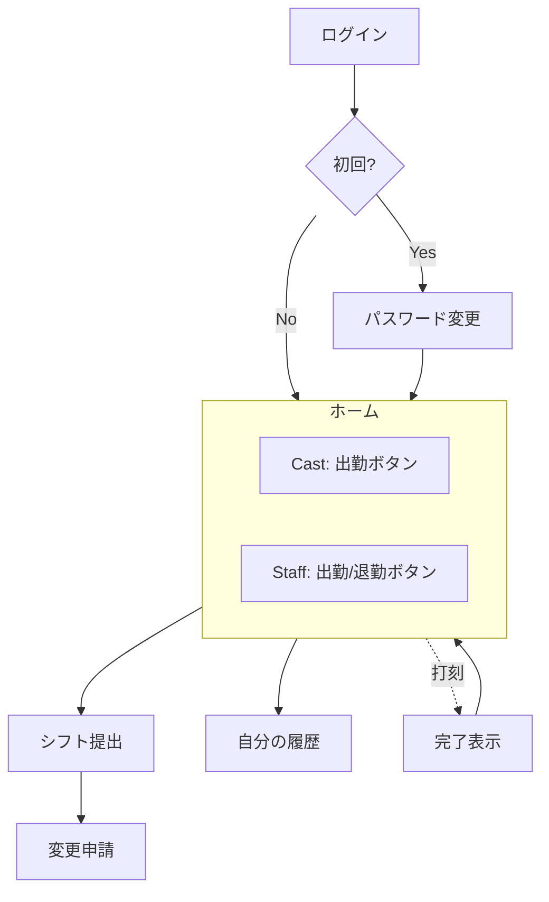
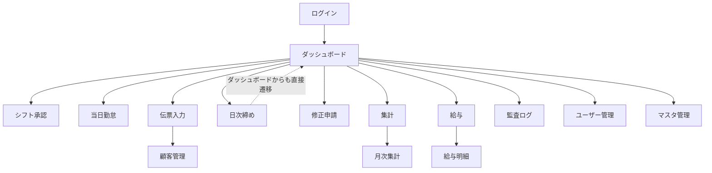
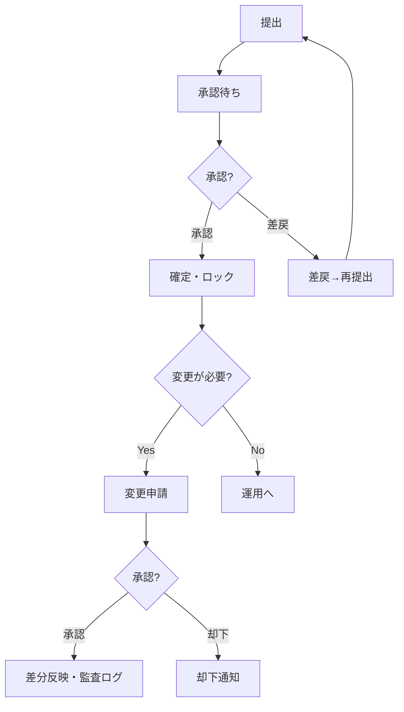
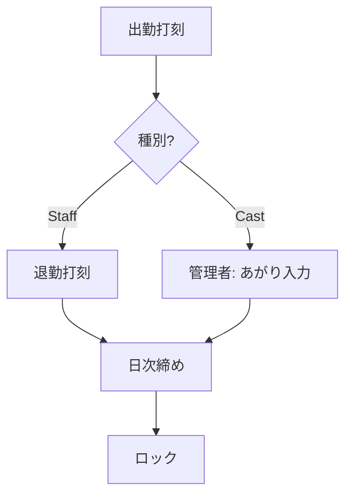
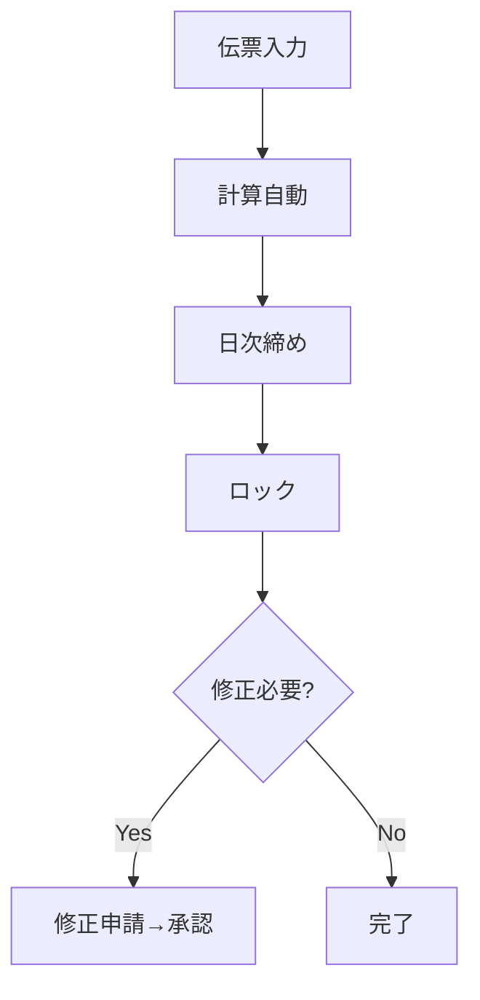
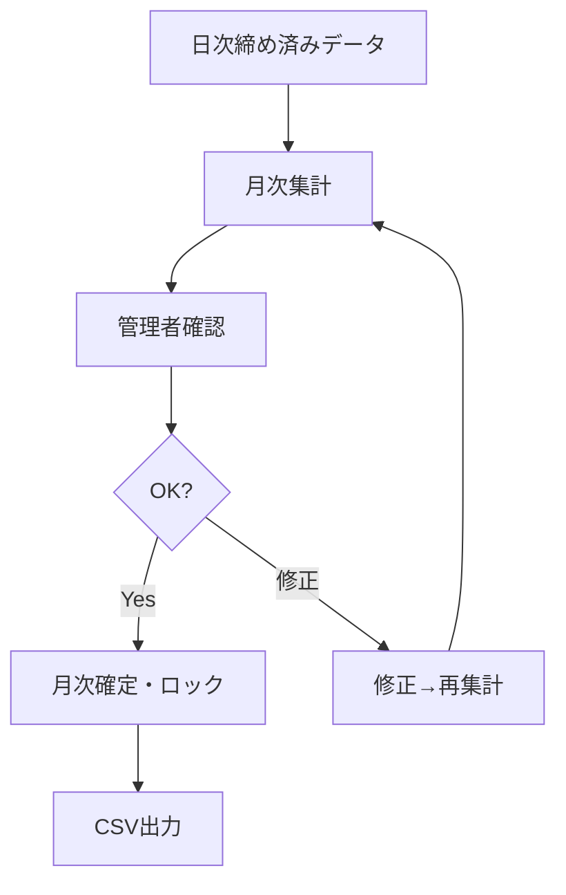
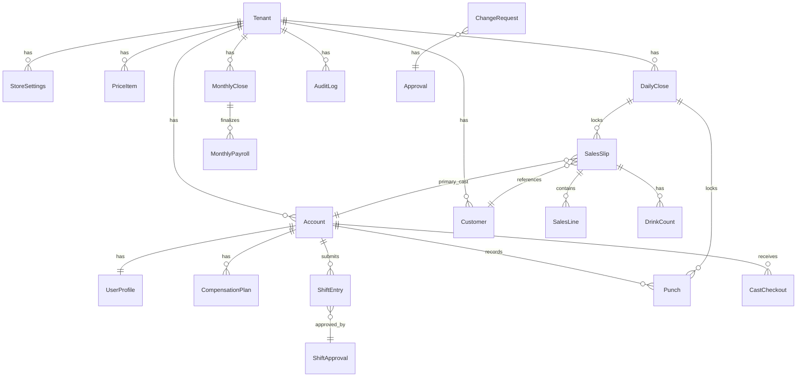

# NightOps 基本設計書

> 文書ID: BD-001  
> バージョン: 2.0  
> 作成日: 2026-02-25  
> 最終更新: 2026-02-25  
> ステータス: 確定

---

## 1. 全体構成

### 1-1. クライアント

| クライアント | 対象ロール | 技術 |
|---|---|---|
| スマホアプリ | Cast, Staff（将来Manager補助） | Flutter |
| Web管理画面 | Manager, Admin | Next.js |

### 1-2. サーバ

| レイヤー | 技術 | 役割 |
|---|---|---|
| API | NestJS | 認証、勤怠、売上、顧客、給与、締め、監査 |
| DB | PostgreSQL | データ永続化 |
| 通知 | FCM（Phase2） | プッシュ通知 |
| 監視 | Sentry | 例外監視 |

---

## 2. 画面一覧（MVP）

### 2-1. スマホ — Cast

| # | 画面ID | 画面名 | 機能 |
|---|---|---|---|
| 1 | M-010 | ログイン | ID/パスワード入力、初回PW変更 |
| 2 | M-020 | ホーム | 今日の予定、出勤ボタン、通知 |
| 3 | M-030 | シフト提出 | 2週間カレンダー入力 |
| 4 | M-031 | 変更申請 | 理由入力 |
| 5 | M-040 | 自分の履歴 | シフト、勤怠 |

### 2-2. スマホ — Staff

| # | 画面ID | 画面名 | 機能 |
|---|---|---|---|
| 1 | M-010 | ログイン | ID/パスワード入力、初回PW変更 |
| 2 | M-021 | ホーム | 出勤、退勤、通知 |
| 3 | M-030 | シフト提出 | 2週間カレンダー入力 |
| 4 | M-031 | 変更申請 | 理由入力 |
| 5 | M-040 | 自分の履歴 | シフト、勤怠 |

### 2-3. Web管理 — Manager / Admin

| # | 画面ID | 画面名 | 対象 | 機能 |
|---|---|---|---|---|
| 1 | W-010 | ログイン | 共通 | ID/パスワード入力 |
| 2 | W-020 | ダッシュボード | 共通 | 未承認、未締め、未入力の表示 |
| 3 | W-050 | シフト承認 | 共通 | 提出シフトの承認/差戻 |
| 4 | W-060 | 当日勤怠 | 共通 | キャストあがり入力、スタッフ未退勤一覧 |
| 5 | W-070 | 売上伝票入力 | 共通 | 顧客、本指名主担当、明細、杯数 |
| 6 | W-080 | 顧客管理 | 共通 | 検索、詳細、統合（Admin） |
| 7 | W-090 | 日次締め | 共通 | 勤怠、売上の日次締め |
| 8 | W-100 | 修正申請一覧 | 共通 | 申請の承認/却下 |
| 9 | W-110 | 集計・ランキング | 共通 | 日次、月次、ランキング |
| 10 | W-120 | 給与 | 共通 | 月次集計、月次確定、CSV出力 |
| 11 | W-150 | 監査ログ | Admin | 操作ログの検索・閲覧 |
| 12 | W-030 | ユーザー管理 | Admin | 作成、無効化、ID/パス発行 |
| 13 | W-130 | マスタ管理 | Admin | 料金マスタ、店舗設定 |

---

## 3. 画面遷移（概略）

### 3-1. スマホ

### 3-2. Web管理

---

## 4. 業務フロー（MVP）

### 4-1. シフト

### 4-2. 勤怠

### 4-3. 売上

### 4-4. 給与

---

## 5. API一覧（概要）

> パスはAPIプレフィックス `/api` を省略した表記。実際は `/api/auth/login` 等。

### 5-1. 認証

| メソッド | パス | 説明 | 認可 |
|---|---|---|---|
| POST | `/auth/login` | ログイン（JWT発行） | なし |
| POST | `/auth/change-password` | パスワード変更 | 認証済み |
| POST | `/auth/reset-password` | パスワード再発行 | Admin |

### 5-2. 勤怠・シフト

| メソッド | パス | 説明 | 認可 |
|---|---|---|---|
| GET | `/shifts/period` | シフト一覧（期間指定） | 認証済み |
| POST | `/shifts/submit` | シフト提出（2週間分） | Cast, Staff |
| POST | `/shifts/change-request` | シフト変更申請 | Cast, Staff |
| POST | `/shifts/approve` | シフト承認 | Manager, Admin |
| POST | `/punches/checkin` | 出勤打刻 | Cast, Staff |
| POST | `/punches/checkout` | 退勤打刻 | Staff |
| POST | `/cast-checkouts/set` | キャストあがり入力 | Manager, Admin |

### 5-3. 売上

| メソッド | パス | 説明 | 認可 |
|---|---|---|---|
| POST | `/sales/slips` | 伝票作成 | Manager, Admin |
| PUT | `/sales/slips/{id}` | 伝票更新 | Manager, Admin |
| GET | `/sales/slips` | 伝票一覧（日付指定） | Manager, Admin |
| POST | `/sales/slips/{id}/drink-counts` | ドリンク杯数入力 | Manager, Admin |

### 5-4. 締め

| メソッド | パス | 説明 | 認可 |
|---|---|---|---|
| POST | `/close/daily` | 日次締め（勤怠/売上） | Manager, Admin |
| GET | `/close/daily/status` | 日次締め状況確認 | Manager, Admin |

### 5-5. 修正申請

| メソッド | パス | 説明 | 認可 |
|---|---|---|---|
| POST | `/change-requests` | 修正申請作成 | 認証済み |
| POST | `/change-requests/{id}/approve` | 承認 | Manager, Admin |

### 5-6. 顧客

| メソッド | パス | 説明 | 認可 |
|---|---|---|---|
| GET | `/customers` | 顧客一覧/検索 | Manager, Admin |
| POST | `/customers` | 顧客作成 | Manager, Admin |
| PUT | `/customers/{id}` | 顧客更新 | Manager, Admin |
| POST | `/customers/merge` | 顧客統合 | Admin |

### 5-7. 集計

| メソッド | パス | 説明 | 認可 |
|---|---|---|---|
| GET | `/reports/daily` | 日次集計 | Manager, Admin |
| GET | `/reports/monthly` | 月次集計 | Manager, Admin |

### 5-8. 給与

| メソッド | パス | 説明 | 認可 |
|---|---|---|---|
| GET | `/payroll/monthly` | 月次給与一覧 | Manager, Admin |
| POST | `/payroll/monthly/confirm` | 月次確定 | Admin |

### 5-9. マスタ（Admin）

| メソッド | パス | 説明 | 認可 |
|---|---|---|---|
| GET | `/settings` | 店舗設定取得 | Admin |
| PUT | `/settings` | 店舗設定更新 | Admin |
| GET | `/price-items` | 料金マスタ一覧 | Admin |
| POST | `/price-items` | 料金項目追加 | Admin |
| PUT | `/price-items/{id}` | 料金項目更新 | Admin |

### 5-10. ユーザー（Admin）

| メソッド | パス | 説明 | 認可 |
|---|---|---|---|
| GET | `/users` | ユーザー一覧 | Admin |
| POST | `/users` | ユーザー作成 | Admin |
| PUT | `/users/{id}/status` | ユーザーステータス変更 | Admin |

### 5-11. 監査

| メソッド | パス | 説明 | 認可 |
|---|---|---|---|
| GET | `/audit-logs` | 監査ログ検索 | Admin |

---

## 6. データモデル（ER概略）

### 6-1. ER図

> 全操作は `AuditLog` に記録される

### 6-2. テーブル関連概要

| テーブル | 主キー | 主要外部キー | 説明 |
|---|---|---|---|
| `Tenant` | id | — | テナント（契約単位） |
| `StoreSettings` | id | tenantId | 店舗設定 |
| `Account` | id | tenantId | 認証アカウント |
| `UserProfile` | id | accountId, tenantId | ユーザー表示情報 |
| `CompensationPlan` | id | userProfileId, tenantId | 報酬条件 |
| `ShiftEntry` | id | userProfileId, tenantId | シフトデータ |
| `ShiftApproval` | id | submissionId, tenantId | シフト承認 |
| `Punch` | id | userProfileId, tenantId | 打刻 |
| `CastCheckout` | id | punchId, tenantId | あがり時間 |
| `SalesSlip` | id | tenantId | 伝票ヘッダ |
| `SalesLine` | id | salesSlipId | 伝票明細 |
| `DrinkCount` | id | salesSlipId, userProfileId | ドリンク杯数 |
| `Customer` | id | tenantId | 顧客台帳 |
| `CustomerMerge` | id | tenantId | 顧客統合履歴 |
| `DailyClose` | id | tenantId | 営業日締め |
| `ChangeRequest` | id | tenantId | 修正申請 |
| `Approval` | id | changeRequestId | 承認 |
| `AuditLog` | id | tenantId | 監査ログ |
| `MonthlyPayroll` | id | userProfileId, tenantId | 月次給与 |
| `MonthlyClose` | id | tenantId | 月次確定 |
| `PriceItem` | id | tenantId | 料金マスタ |

---

## 7. 計算ロジックの配置

- API側に **純粋関数** として実装し、単体テストで検証
- WebとモバイルはAPI計算結果を表示するだけ（入力補助としてのプレビュー計算に限定）
- 計算関数は `packages/shared/src/calculations/` に配置
- 売上計算（小計、税サービス、丸め）と給与計算（時給、バック、総支給）が対象

---

## 8. 例外方針

| 例外 | 対応 |
|---|---|
| 計算不一致 | 拒否し、エラーレスポンスを返す |
| 締め済みデータの編集 | 拒否（409 ALREADY_CLOSED） |
| 権限外アクセス | 拒否（403 FORBIDDEN） |
| テナント外アクセス | 拒否（403 FORBIDDEN） |

上記すべてを **監査ログに記録** する。

---

## 9. 営業日の定義

- 営業日 = 営業開始日（18:00頃開始 〜 翌日閉店）
- 打刻・伝票のデータは「営業日」に紐付き、カレンダー日とは異なる場合がある
- 日付切り替えの閾値: テナント設定の `businessDayCutoff`（MVP初期値: 06:00）
  - 例: 2月25日 06:00 以前の打刻 → 2月24日営業日に帰属
- 日次締めは営業日単位で実行

---

## 10. 通知設計（MVP）

MVPではプッシュ通知は未実装。アプリ内通知のみ。Phase2でFCMプッシュ通知を追加。

| 通知種別 | 対象 | タイミング |
|---|---|---|
| シフト提出期限 | Cast, Staff | 期限の24時間前 |
| 未承認シフト | Manager | 提出から24時間未承認 |
| シフト承認/差戻 | 申請者 | 承認/差戻時 |
| 未締め営業日 | Manager | 翌日の所定時刻 |
| 未打刻 | Cast, Staff | シフト予定あり＋出勤打刻なし |
| 未あがり | Manager | キャスト出勤済み＋あがり未入力 |
| 未退勤 | Manager | スタッフ出勤済み＋退勤未入力 |
| 変更申請 | Manager | 申請作成時 |
| 変更申請承認/却下 | 申請者 | 承認/却下時 |
