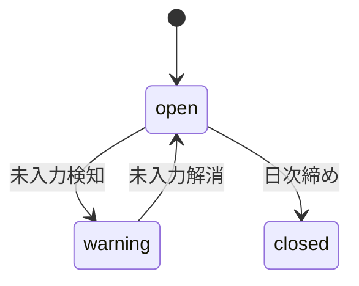
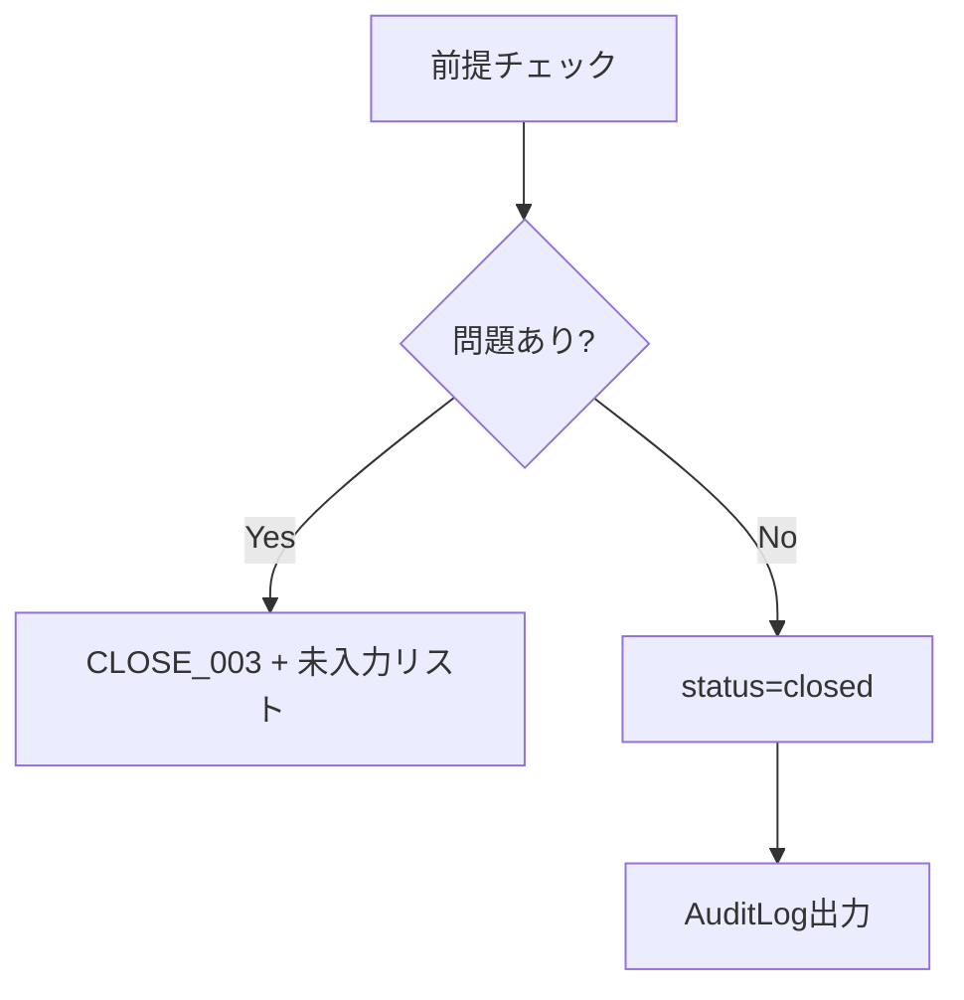
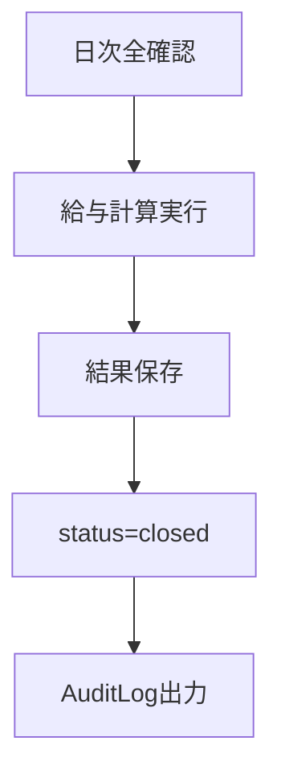

# Doc-15 締め・ロック・修正フロー設計書

> プロジェクト: NightOps  
> バージョン: 1.0  
> 作成日: 2026-02-25  
> ステータス: MVP確定版

---

## 1. 目的

本SaaSにおいて「締め」と「改ざん防止」は最重要制御。

---

## 2. 状態モデル

### DailyClose.status

| 状態 | 説明 |
|---|---|
| open | 編集可能 |
| warning | 未入力あり |
| closed | 完全ロック |

### 状態遷移

> `warning → closed`（強制締め）は不可。`closed → reopen` は MVP では不可（Phase2）。

---

## 3. 日次締め前チェック項目

| チェック | 違反時 |
|---|---|
| キャストあがり未入力 | CLOSE_003 |
| スタッフ退勤未入力 | CLOSE_003 |
| 未承認シフト | CLOSE_003 |
| 売上伝票未保存 | CLOSE_003 |
| ChangeRequest 未処理 | CLOSE_003 |

---

## 4. ロック対象データ

### 日次締め後

ShiftEntry / PunchEvent / CastCheckout / SalesSlip / SalesLine / DrinkCount / CustomerMerge

### 月次確定後

MonthlyPayroll / CompensationPlan（該当期間）

---

## 5. ロック実装方式

1. `DailyClose.status = closed` をチェック
2. 更新 API で `CloseGuard` 実行
3. DB レベルでは物理ロックしない（アプリ制御で強制）

---

## 6. 修正申請フロー

### ChangeRequest 状態

`pending` → `approved` / `rejected`

### 申請対象
打刻修正、あがり時間修正、売上伝票修正、顧客統合取消、給与再計算

### 必須項目
reason（必須）、beforeData、afterData

### 承認権限
Manager / Admin（給与関連は Admin のみ）

---

## 7. 修正承認後処理（補正イベント方式）

| 対象 | 処理 |
|---|---|
| 売上修正 | 元データ変更不可 → CorrectionSlip 追加 → 差額反映 → AuditLog |
| 給与修正 | CorrectionPayroll 生成 → 再計算 → AuditLog |

---

## 8. 月次確定

### MonthlyClose.status

`open` → `closed`

### 確定条件
- 対象月の日次締め完了
- 未処理 ChangeRequest なし

### 確定後
- 給与再計算不可
- CompensationPlan 変更不可（該当期間）

---

## 9. 再確定ルール

- **MVP**: 再確定不可
- **Phase2**: Admin + 理由必須 + AuditLog + 差分履歴保持

---

## 10. 締め処理フロー

### 日次締め

### 月次確定

---

## 11. 不正防止設計

- 直接 UPDATE 禁止
- ChangeRequest 経由必須
- 承認ログ必須
- 締め解除不可（MVP）

---

## 12. テスト項目

| テスト | 検証内容 |
|---|---|
| 締め後更新不可 | 409 CLOSE_001 |
| 未あがりで締め不可 | 409 CLOSE_003 |
| Correction 生成 | 補正レコード確認 |
| 監査ログ出力 | AuditLog 生成確認 |
| 給与期間ロック | CompensationPlan 変更不可 |

---

## 13. 完了条件

- 締め後直接編集不可
- 修正は申請経由のみ
- 監査ログ100%出力
- 売上/給与の整合保持
- 手計算との一致確認
